# 基于 PS 签名的匿名投票与标识符方案

本方案面向需要同时平衡匿名性、抗滥用能力以及可撤销性的匿名投票场景。方案核心流程融合了类 OPAQUE 密码认证过程与 BLS12-381
双线性配对密码学。借助 VOPRF 机制，客户端可独立派生高熵私密种子，并在对其加密后安全交由服务端存储。在凭证签发阶段，方案借助
Pointcheval-Sanders 盲签名发放带有 Role-based 属性声明的匿名凭证，从而确保所有重复证明之间存在天然不可关联性。为抵御
Double-voting 与 Sybil 攻击，方案针对投票对象进一步派生各域内唯一但跨域脱钩的匿名标识符。最终，证明层将非交互式 Sigma
协议封装为二进制 NIZK 报文，并直接集成撤销机制，支持已认证用户通过可信信道安全撤销既有投票记录。

## 1. 密码学原语与系统参数

本方案运行在配对友好型椭圆曲线 BLS12-381 上，定义素数阶为 $p$。

* **群生成元及配对**：
    * $G$ 为 $\mathbb{G}$ 群的生成元。
    * $\tilde{G}$ 为 $\tilde{\mathbb{G}}$ 群的生成元。
    * $\tilde{G}_{neg} = (-1) \cdot \tilde{G}$ 为 $\tilde{\mathbb{G}}$ 的负生成元，用于通过配对等式校验抵消项。
    * $e: \mathbb{G} \times \tilde{\mathbb{G}} \to \mathbb{G}_T$ 为映射，满足双线性、非退化性与可计算性。
* **哈希函数**：
    * $H_p: \{0, 1\}^* \to \mathbb{G}$：将任意长度输入映射到 $\mathbb{G}$ 群上的点（Hash-to-Curve）。
    * $H_s: \{0, 1\}^* \to \mathbb{Z}_p$：将任意长度输入映射到标量域 $\mathbb{Z}_p$（Hash-to-Scalar）。
* **辅助函数**：
    * $\oplus$：一对等长字节序列的按位异或运算。
    * $\mathrm{HMAC}(\textit{key}, \textit{input})$：使用 $key$ 对 $input$ 计算 HMAC（基于 SHA512），输出 64 个字节。
    * $\mathrm{PBKDF2}(\mathrm{HMAC}, \textit{input}, \textit{iters}, \textit{count})$：密钥派生函数，取前
      $\textit{count}$ 个字节。
* **存储原语**：
    * `DB.fetchAccount`：读取账户关联的信封、承诺或其他账户数据，并返回账户、身份属性或注册状态。
    * `DB.fetchRevocations`：读取已有的撤销列表。
    * `DB.fetchVotes`：按给定标识匹配关系读取投票记录。
    * `DB.fetchWorks`：读取全部投票对象信息。
    * `DB.purgeVotes`：按给定投票对象匹配关系清除全部投票记录。
    * `DB.purgeWork`：清除投票对象信息，但不清除既有投票记录。
    * `DB.storeAccount`：写入账户初始化阶段的覆盖凭证、账户绑定关系及其关联状态。
    * `DB.storeRevocation`：写入撤销列表中的撤销原语。
    * `DB.storeVote`：写入指定的投票记录。
    * `DB.storeWork`：追加或修改投票对象信息。
* **系统参数**：
    * $seed$：服务端持有的私密派生令牌。
    * $uuid$：用户唯一标识符。
    * $role$：凭证中的角色属性。
    * $pass$：用户登录口令。
    * $mnem$：用户恢复助记词。
    * $salt$：信封与派生过程中的盐值。
    * $work$：投票对象或业务域标识。
    * $info$：投票时提交的公开信息。

## 2. 方案流程

### A. 用户注册流程

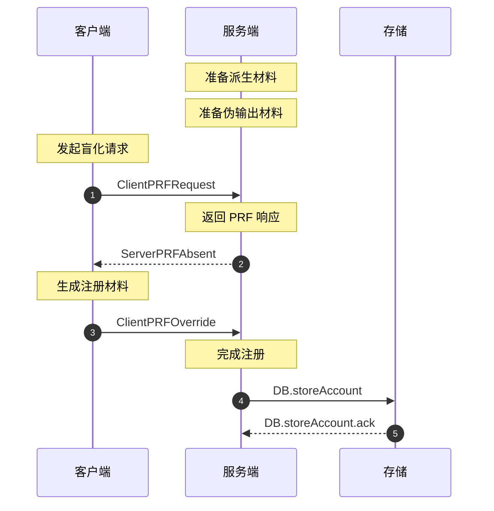

1. **服务端准备派生材料**：
    * 服务端持有不可对外公开的令牌 $seed$，对四个密钥对分别选取盐值。
    * 对用户相关 OPRF 密钥对 $(v, \tilde{V})$，将 `id-`、用户 $uuid$ 和 `-oprf-key` 的拼接结果作为盐值。
    * 用户相关 OPRF 盐值示例：`id-89abcdef-0123-4567-89ab-cdef01234567-oprf-key`。
    * 对系统签名密钥对 $(w, \tilde{W}), (x, \tilde{X}), (y, \tilde{Y})$，分别使用常量 `role-key`、`base-key` 和 `bind-key`
      作为盐值。
    * 用不同盐值计算 $H_s(\mathrm{PBKDF2}(\mathrm{HMAC}, \textit{seed}, 2048, 96))$ 得到私钥，其中 $v$
      和用户有关，$SK = (w, x, y)$ 由 $seed$ 唯一决定。
    * 进一步计算公钥 $\tilde{V} = v \cdot \tilde{G}$
      和 $PK = (\tilde{W}, \tilde{X}, \tilde{Y}) = (w \cdot \tilde{G}, x \cdot \tilde{G}, y \cdot \tilde{G})$。
    * 若私钥派生结果不满足要求，则延长 $\mathrm{PBKDF2}$ 输出并重试，直到私钥满足条件。
2. **服务端准备伪输出材料**：
    * 将 `id-`、用户 $uuid$ 和 `-fake-key`
      的拼接结果作为盐值，计算 $\mathrm{PBKDF2}(\mathrm{HMAC}, \textit{seed}, 2048, 256)$。
    * 取前 96 字节记为 $\upsilon^{\ast}$ 并计算 $v^{\ast} = H_s(\upsilon^{\ast})$，后 160 字节按 32
      字节分割，记为 $(salt^{\ast}, \phi_{pass}^{\ast}, \psi_{pass}^{\ast}, \phi_{mnem}^{\ast}, \psi_{mnem}^{\ast})$。
    * 若伪私钥派生结果不满足要求，则延长 $\mathrm{PBKDF2}$ 输出并重试，直到私钥满足条件。
3. **客户端发起盲化请求**：
    * 客户端输入登录密码 $pass$ 并计算哈希点 $P_{pass} = H_p(pass)$。
    * 选取随机盲化因子 $r \in \mathbb{Z}_p$，发送 `ClientPRFRequest` $M = r \cdot P_{pass}$ 至服务端。
4. **服务端返回 PRF 响应**：
    * 服务端利用关联密钥 $v$ 计算 $N = v \cdot M$。
    * 服务端发送 `ServerPRFAbsent` $N$ 至客户端。
5. **客户端生成注册材料并提交覆盖凭证**：
    * 客户端计算 $v \cdot P_{pass} = r^{-1} \cdot N$。
    * 客户端在本地随机生成私钥 $s \in \mathbb{Z}_p$、恢复助记词 $mnem$ 和 32 字节随机序列 $salt$。
    * 执行 $\mathrm{PBKDF2}(\mathrm{HMAC}, H_s(pass, v \cdot P_{pass}), 2048, 64)$，取前 32 字节为 $\phi_{pass}$，后 32
      字节为 $\psi_{pass}$，盐值使用 `password`。
    * 执行 $\mathrm{PBKDF2}(\mathrm{HMAC}, mnem, 2048, 64)$，取前 32 字节为 $\phi_{mnem}$，后 32 字节为 $\psi_{mnem}$，盐值使用
      `mnemonic`。
    * 构造认证上下文 $\tau_{pass} = (salt, \psi_{pass} \oplus s, \tilde{V}, PK)$
      与 $\tau_{mnem} = (salt, \psi_{mnem} \oplus s, \tilde{V}, PK)$。
    * 计算认证码 $\alpha_{pass} = \mathrm{HMAC}(\phi_{pass}, \tau_{pass})$
      与 $\alpha_{mnem} = \mathrm{HMAC}(\phi_{mnem}, \tau_{mnem})$。
    * 计算 $S = s \cdot G$
      和 $\epsilon = (salt, \psi_{pass} \oplus s, \alpha_{pass}, \psi_{mnem} \oplus s, \alpha_{mnem})$。
    * 客户端提交 `ClientPRFOverride` $(S, \epsilon)$。
6. **服务端完成注册**：
    * 服务端直接执行 `DB.storeAccount` 存储 $(S, \epsilon)$ 及必要的账户绑定状态，并完成账户绑定。

### B. 用户密码登录

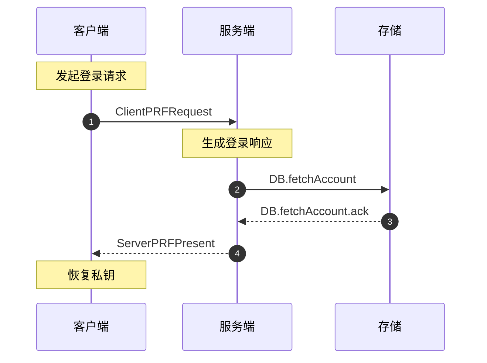

1. **客户端发起登录请求**：
    * 客户端发送 $M = r \cdot H_p(pass)$。
    * 服务端执行 `DB.fetchAccount` 读取用户 $uuid$ 对应账户。
2. **服务端生成登录响应**：
    * 若读取结果为 “已匹配”，则服务端直接使用返回结果中的 $\epsilon$，并结合 $v$ 计算响应后返回
      `ServerPRFPresent` $(N, \epsilon)$。
    * 若读取结果为“不存在”，则使用
      $(salt^{\ast}, \phi_{pass}^{\ast}, \psi_{pass}^{\ast}, \phi_{mnem}^{\ast}, \psi_{mnem}^{\ast})$
      替代真实参数，并以 $v^{\ast}$ 替代 $v$ 计算伪响应值 $(N^{\ast}, \epsilon^{\ast})$。
    * 服务端返回 `ServerPRFPresent` $(N, \epsilon)$ 或 $(N^{\ast}, \epsilon^{\ast})$，以防止客户端穷举用户注册状态。
3. **客户端恢复私钥**：
    * 客户端恢复 $v \cdot P_{pass}$ 并通过 $pass$ 重新派生 $(\phi_{pass}, \psi_{pass})$。
    * 从 $\epsilon$ 中提取 $\psi_{pass} \oplus s$
      并校验 $\mathrm{HMAC}(\phi_{pass}, (salt, \psi_{pass} \oplus s, \tilde{V}, PK)) \stackrel{?}{=} \alpha_{pass}$。
    * 校验成功后恢复私钥 $s$。

### C. 助记短语恢复

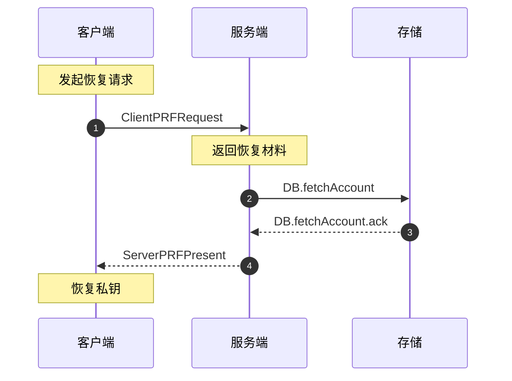

1. **客户端发起恢复请求**：
    * 客户端发送 $M = r \cdot H_p(pass)$。
    * 服务端执行 `DB.fetchAccount` 读取用户 $uuid$ 对应账户。
2. **服务端返回恢复材料**：
    * 服务端根据账户读取结果返回对应恢复材料后返回 `ServerPRFPresent`，和用户密码登录流程一致。
3. **客户端恢复私钥**：
    * 用户输入助记词 $mnem$。
    * 客户端通过 $mnem$ 重新派生 $(\phi_{mnem}, \psi_{mnem})$。
    * 从 $\epsilon$ 中提取 $\psi_{mnem} \oplus s$
      并校验 $\mathrm{HMAC}(\phi_{mnem}, (salt, \psi_{mnem} \oplus s, \tilde{V}, PK)) \stackrel{?}{=} \alpha_{mnem}$。
    * 校验成功后恢复私钥 $s$。

### D. 用户签名授权

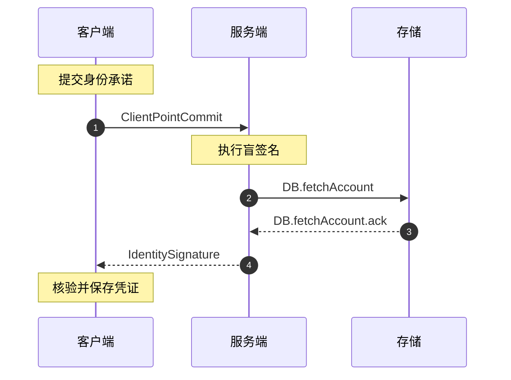

1. **客户端提交身份承诺**：
    * 客户端读取本地私钥 $s$ 并计算点承诺 $S = s \cdot G$。
    * 客户端发送 `ClientPointCommit` $S$ 至服务端。
2. **服务端确认身份属性并执行盲签名**：
    * 服务端先执行 `DB.fetchAccount` 读取用户身份属性与已存储的承诺 $S$。
    * 签名授权阶段要求该用户身份属性的读取结果为 “已匹配”，否则签发失败。
    * 服务端比对客户端提交的 $S$ 与已存储的 $S$ 是否一致，并在一致后指定 $role$。
    * 计算角色标量 $h_{role} = H_s(role)$。
    * 服务端选取随机数 $r \in \mathbb{Z}_p$。
    * 计算签名基点 $A = r \cdot G$。
    * 计算盲化签名 $B = (h_{role} \cdot w + x) \cdot A + y \cdot (r \cdot S)$。
    * 返回 `IdentitySignature` $\sigma = (role, A, B)$。
3. **客户端核验并保存凭证**：
    * 客户端计算角色哈希 $h_{role} = H_s(role)$。
    * 校验配对等式
      $e(B, \tilde{G}_{neg}) \cdot e(A, h_{role} \cdot \tilde{W} + \tilde{X} + s \cdot \tilde{Y}) \stackrel{?}{=} 1_T$。
    * 若校验通过，则该凭证有效并存储。

### E. 用户发送投票

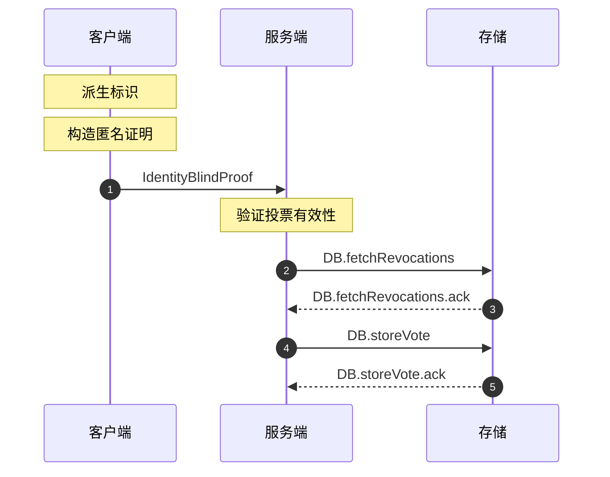

1. **客户端派生标识**：
    * 计算投票对象 $work$ 的哈希点 $P_{work} = H_p(work)$。
    * 计算派生标识符 `IdentityDerivation` $ID = s \cdot P_{work}$。
2. **客户端构造匿名证明**：
    * 选取随机数 $q, r \in \mathbb{Z}_p$。
    * 重随机化签名：$A' = q \cdot A, B' = q \cdot B$。
    * 生成承诺：$Q = r \cdot P_{work}$，$R = e(A', r \cdot \tilde{Y})$。
    * 生成挑战：$c = H_s(PK, H_s(work, ID, info, role, A', B'), Q, R)$。
    * 生成响应：$z = r + c \cdot s \pmod p$。
    * 构造证明：$\pi = (work, ID, info, role, A', B', c, z)$。
    * 提交 `IdentityBlindProof` $\pi$，包含公开信息 $info$ 以及身份合法性证明。
3. **服务端验证投票有效性**：
    * 服务端先执行 `DB.fetchRevocations` 读取撤销列表中的每一项 $\tilde{C}_i$。
    * 对撤销列表中的每一项 $\tilde{C}_i$，都必须执行撤销核验
      $e(ID, \tilde{G}) \stackrel{?}{=} e(P_{work}, \tilde{C}_i)$。
    * 若任一项的撤销核验成立，或未完成对全部列表项的逐项核验，则本次投票不通过。
    * 重构验证中间值 $d' = H_s(work, ID, info, role, A', B')$ 和 $h_{role} = H_s(role)$。
    * 重建承诺
      $Q' = z \cdot P_{work} - c \cdot ID$ 和
      $R' = e(A', c \cdot h_{role} \cdot \tilde{W} + c \cdot \tilde{X} + z \cdot \tilde{Y}) \cdot e(c \cdot B', \tilde{G}_{neg})$。
    * 检查 $H_s(PK, d', Q', R') \stackrel{?}{=} c$。
    * 若校验通过，则执行 `DB.storeVote` 存储对应的 $ID$ 与 $info$。

### F. 用户投票撤销

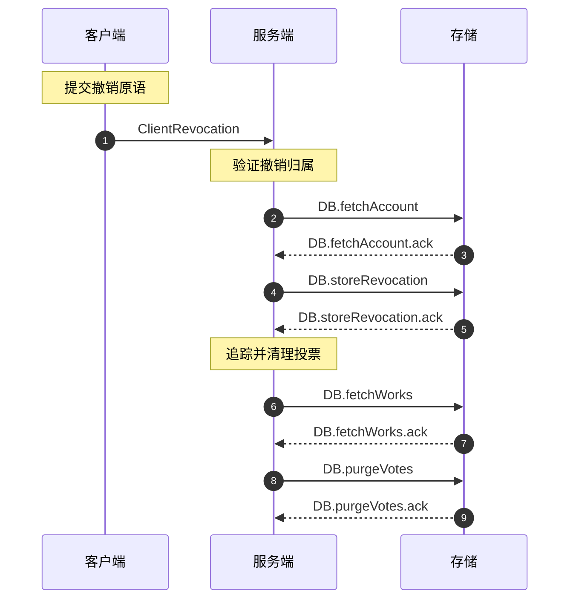

1. **客户端提交撤销原语**：
    * 用户通过认证信道发送 `ClientRevocation` $\tilde{C} = s \cdot \tilde{G}$。
2. **服务端验证撤销归属**：
    * 服务端先执行 `DB.fetchAccount` 读取用户身份属性与当前账户关联的承诺 $S$。
    * 撤销授权阶段要求该用户身份属性的读取结果为 “已匹配”，否则撤销失败。
    * 服务端使用读取出的 $S$ 核验 $e(S, \tilde{G}_{neg}) \cdot e(G, \tilde{C}) = 1_T$。
3. **服务端追踪并清理投票**：
    * 服务端执行 `DB.storeRevocation` 将 $\tilde{C}$ 放入撤销列表。
    * 服务端执行 `DB.fetchWorks` 读取全部投票对象信息，并对每个投票对象计算对应的 $P_{work} = H_p(work)$。
    * 服务端对每个投票对象执行 `DB.purgeVotes`，清除所有满足
      $e(ID, \tilde{G}) \stackrel{?}{=} e(P_{work}, \tilde{C})$ 的投票记录。

## 3. 详细等式证明

* **VOPRF 验证证明**  
  $e(N, \tilde{G}_{neg}) \cdot e(M, \tilde{V}) = e(v \cdot M, \tilde{G})^{-1} \cdot e(M, v \cdot \tilde{G}) = e(M, \tilde{G})^{-v} \cdot e(M, \tilde{G})^v = 1_T$
* **盲签名验证证明**  
  $e(B, \tilde{G}_{neg}) \cdot e(A, h_{role} \cdot \tilde{W} + \tilde{X} + s \cdot \tilde{Y}) = e((h_{role} \cdot w + x + s \cdot y) \cdot A, \tilde{G}_{neg}) \cdot e(A, (h_{role} \cdot w + x + s \cdot y) \cdot \tilde{G}) = 1_T$
* **匿名证明 $Q'$ 重建证明**  
  $Q' = z \cdot P_{work} - c \cdot ID = (r + c \cdot s) \cdot P_{work} - c \cdot (s \cdot P_{work}) = r \cdot P_{work} + (c \cdot s - c \cdot s) \cdot P_{work} = Q$
* **匿名证明 $R'$ 重建证明**  
  $\begin{aligned} R' &= e(A', c \cdot h_{role} \cdot \tilde{W} + c \cdot \tilde{X} + z \cdot \tilde{Y}) \cdot e(c \cdot B', \tilde{G}_{neg}) \\ &= e(A', c \cdot h_{role} \cdot \tilde{W} + c \cdot \tilde{X} + (r + c \cdot s) \cdot \tilde{Y}) \cdot e(c \cdot B', \tilde{G}_{neg}) \\ &= e(A', r \cdot \tilde{Y}) \cdot e(A', c \cdot (h_{role} \cdot \tilde{W} + s \cdot \tilde{Y} + \tilde{X})) \cdot e(c \cdot B', \tilde{G}_{neg}) \\ &= R \cdot e(c \cdot A', (h_{role} \cdot w + x + s \cdot y) \cdot \tilde{G}) \cdot e(c \cdot B', \tilde{G}_{neg}) \\ &= R \cdot e(c \cdot (h_{role} \cdot w + x + s \cdot y) \cdot A', \tilde{G}) \cdot e(c \cdot B', \tilde{G}_{neg}) \\ &= R \cdot e(c \cdot B', \tilde{G}) \cdot e(c \cdot B', \tilde{G}_{neg}) \\ &= R \end{aligned}$
* **撤销归属验证证明**  
  $e(S, \tilde{G}_{neg}) \cdot e(G, \tilde{C}) = e(s \cdot G, \tilde{G}_{neg}) \cdot e(G, s \cdot \tilde{G}) = e(G, \tilde{G})^{-s} \cdot e(G, \tilde{G})^s = 1_T$
* **撤销标识符检索证明**  
  $e(ID, \tilde{G}) = e(s \cdot P_{work}, \tilde{G}) = e(P_{work}, s \cdot \tilde{G}) = e(P_{work}, \tilde{C})$

## 4. 实体对象映射表

| 类名                   | 对应方案变量                                       | 字节数 (BLS12-381)                                 |
|:---------------------|:---------------------------------------------|:------------------------------------------------|
| `ClientPointCommit`  | $S = s \cdot G$                              | $48$                                            |
| `ClientPRFOverride`  | $(S, \epsilon)$                              | $272$                                           |
| `ClientPRFRequest`   | $M = r \cdot P_{pass}$                       | $48$                                            |
| `ClientRevocation`   | $\tilde{C} = s \cdot \tilde{G}$              | $96$                                            |
| `ClientSecretKey`    | $s$                                          | $32$                                            |
| `IdentityDerivation` | $ID = s \cdot P_{work}$                      | $48$                                            |
| `IdentityBlindProof` | $\pi = (work, ID, info, role, A', B', c, z)$ | $224 + \mathrm{len}(role) + \mathrm{len}(info)$ |
| `IdentityUserEntry`  | $(uuid, S, \epsilon, role)$                  | $288 + \mathrm{len}(role)$                      |
| `IdentitySignature`  | $\sigma = (role, A, B)$                      | $96 + \mathrm{len}(role)$                       |
| `ServerPRFAbsent`    | $N = v \cdot M$                              | $48$                                            |
| `ServerPRFPresent`   | $(N, \epsilon)$                              | $272$                                           |
| `ServerPublicKey`    | $(\tilde{V}, PK)$                            | $384$                                           |
| `ServerSecretKey`    | $(v, SK)$                                    | $128$                                           |

***

# Anonymous Voting and ID Scheme via PS Signatures

This scheme is designed for anonymous voting scenarios that balance privacy, abuse resistance, and revocability at once.
Its core flow combines an OPAQUE-like password authentication process with the BLS12-381 bilinear pairing cryptography.
With the help of a VOPRF, the client can independently derive a high-entropy private seed and then, after encrypting it,
securely sent to the server for storage. During credential issuance, the scheme uses blind signatures which are based on
the Pointcheval-Sanders construction to issue anonymous credentials carrying role-based attribute claims, ensuring that
naturally repeated proof presentations remain unlinkable. For voting targets, in order to resist Double-voting and Sybil
attacks, the scheme further derives anonymous identifiers that are unique within each domain yet decoupled across other
domains. Finally, the proof layer packages non-interactive Sigma protocols into binary NIZK payloads and also directly
integrates a revocation mechanism for authenticated end users, allowing them to securely revoke existing voting records
through trusted channels.

## 1. Cryptographic Primitives and System Parameters

The scheme is implemented on the pairing-friendly elliptic curve BLS12-381 with a prime order $p$.

* **Group Generators and Pairing**:
    * $G$ is the generator of group $\mathbb{G}$.
    * $\tilde{G}$ is the generator of group $\tilde{\mathbb{G}}$.
    * $\tilde{G}_{neg} = (-1) \cdot \tilde{G}$ is the negative generator of $\tilde{\mathbb{G}}$, used for cancellation
      in pairing verification equations.
    * $e: \mathbb{G} \times \tilde{\mathbb{G}} \to \mathbb{G}_T$ is a map that satisfies bilinearity, non-degeneracy,
      and computability.
* **Hash Functions**:
    * $H_p: \{0, 1\}^* \to \mathbb{G}$: Maps an arbitrary string to a point in $\mathbb{G}$ (Hash-to-Curve).
    * $H_s: \{0, 1\}^* \to \mathbb{Z}_p$: Maps an arbitrary string to a scalar in $\mathbb{Z}_p$ (Hash-to-Scalar).
* **Auxiliary Functions**:
    * $\oplus$: Bitwise XOR over equal-length byte strings.
    * $\mathrm{HMAC}(\textit{key}, \textit{input})$: HMAC computation (based on SHA512) over $\textit{input}$ keyed
      by $\textit{key}$, with a 64-byte output.
    * $\mathrm{PBKDF2}(\mathrm{HMAC}, \textit{input}, \textit{iters}, \textit{count})$: A password-based key derivation
      function; outputs the first $\textit{count}$ bytes.
* **Storage Primitives**:
    * `DB.fetchAccount`: Reads account-associated envelopes, commitments, or other account data, and returns account,
      identity-attribute, or registration state.
    * `DB.fetchRevocations`: Reads the existing revocation list.
    * `DB.fetchVotes`: Reads vote records using a given identifier-matching relation.
    * `DB.fetchWorks`: Reads all voting-target metadata.
    * `DB.purgeVotes`: Clears all vote records using a given voting-target matching relation.
    * `DB.purgeWork`: Clears voting-target metadata without clearing existing votes.
    * `DB.storeAccount`: Writes override credentials, account bindings, and related account state during initialization.
    * `DB.storeRevocation`: Writes a revocation token into the revocation list.
    * `DB.storeVote`: Writes a target vote record.
    * `DB.storeWork`: Appends or updates voting-target metadata.
* **System Parameters**:
    * $seed$: Server-held secret derivation token.
    * $uuid$: Unique user identifier.
    * $role$: Role attribute in credentials.
    * $fake$: Fixed label used for fake-output derivation (mapped to `fake-key`).
    * $pass$: User login password.
    * $mnem$: User recovery mnemonic.
    * $salt$: Salt used in envelope and derivation steps.
    * $work$: Voting target or domain identifier.
    * $info$: Public payload submitted with a vote.

## 2. Scheme Process Flow

### A. User Registration Flow

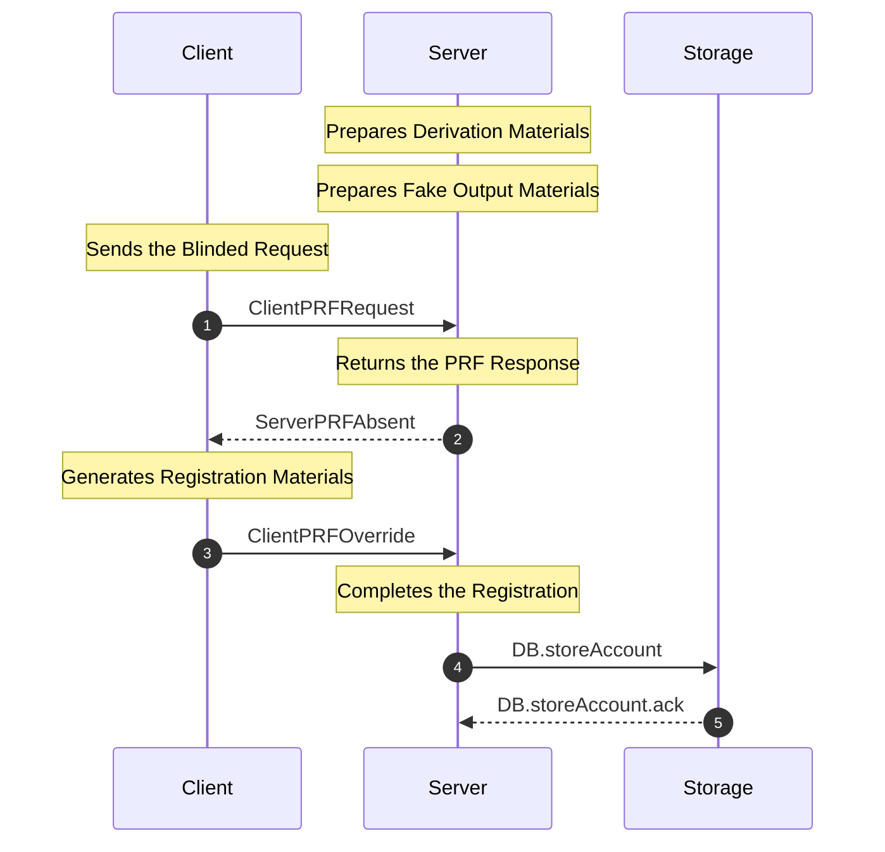

1. **Server Prepares Derivation Materials**:
    * Server holds the non-public token $seed$ and selects salts for four key pairs.
    * For the user-specific OPRF key pair $(v, \tilde{V})$, the salt is the concatenation of `id-`, user $uuid$, and
      `-oprf-key`.
    * Example user-specific OPRF salt: `id-89abcdef-0123-4567-89ab-cdef01234567-oprf-key`.
    * For the system signing key pairs $(w, \tilde{W}), (x, \tilde{X}), (y, \tilde{Y})$, the salts are the constants
      `role-key`, `base-key`, and `bind-key`, respectively.
    * For each salt, compute $H_s(\mathrm{PBKDF2}(\mathrm{HMAC}, \textit{seed}, 2048, 96))$ to derive server private
      keys, where $v$ is user-specific and $SK = (w, x, y)$ is uniquely determined by $seed$.
    * Then compute $\tilde{V} = v \cdot \tilde{G}$
      and $PK = (\tilde{W}, \tilde{X}, \tilde{Y}) = (w \cdot \tilde{G}, x \cdot \tilde{G}, y \cdot \tilde{G})$.
    * If a derived private key does not satisfy the requirement, extend the $\mathrm{PBKDF2}$ output and retry until it
      does.
2. **Server Prepares Fake Output Materials**:
    * Use the concatenation of `id-`, user $uuid$, and `-fake-key` as the salt, and
      compute $\mathrm{PBKDF2}(\mathrm{HMAC}, \textit{seed}, 2048, 256)$.
    * Let the first 96 bytes be $\upsilon^{\ast}$ and compute $v^{\ast} = H_s(\upsilon^{\ast})$.
    * Split the remaining 160 bytes
      into $(salt^{\ast}, \phi_{pass}^{\ast}, \psi_{pass}^{\ast}, \phi_{mnem}^{\ast}, \psi_{mnem}^{\ast})$.
    * If the fake private-key derivation does not satisfy the requirement, extend the $\mathrm{PBKDF2}$ output and retry
      until it does.
3. **Client Sends the Blinded Request**:
    * Client inputs the login password $pass$ and computes the hash point $P_{pass} = H_p(pass)$.
    * Client samples a random blinding factor $r \in \mathbb{Z}_p$ and sends `ClientPRFRequest` $M = r \cdot P_{pass}$
      to the server.
4. **Server Returns the PRF Response**:
    * Server computes $N = v \cdot M$ using the associated key $v$.
    * Server sends `ServerPRFAbsent` $N$ to the client.
5. **Client Generates Registration Materials and Submits the Override Credential**:
    * Client computes $v \cdot P_{pass} = r^{-1} \cdot N$.
    * Client locally generates secret key $s \in \mathbb{Z}_p$, recovery mnemonic $mnem$, and a 32-byte random $salt$.
    * Execute $\mathrm{PBKDF2}(\mathrm{HMAC}, H_s(pass, v \cdot P_{pass}), 2048, 64)$, taking the first 32 bytes
      as $\phi_{pass}$ and the latter 32 bytes as $\psi_{pass}$ with salt `password`.
    * Execute $\mathrm{PBKDF2}(\mathrm{HMAC}, mnem, 2048, 64)$, taking the first 32 bytes as $\phi_{mnem}$ and the
      latter 32 bytes as $\psi_{mnem}$ with salt `mnemonic`.
    * Construct authentication contexts $\tau_{pass} = (salt, \psi_{pass} \oplus s, \tilde{V}, PK)$
      and $\tau_{mnem} = (salt, \psi_{mnem} \oplus s, \tilde{V}, PK)$.
    * Compute authentication codes $\alpha_{pass} = \mathrm{HMAC}(\phi_{pass}, \tau_{pass})$
      and $\alpha_{mnem} = \mathrm{HMAC}(\phi_{mnem}, \tau_{mnem})$.
    * Compute $S = s \cdot G$
      and $\epsilon = (salt, \psi_{pass} \oplus s, \alpha_{pass}, \psi_{mnem} \oplus s, \alpha_{mnem})$.
    * Client submits `ClientPRFOverride` $(S, \epsilon)$.
6. **Server Completes Registration**:
    * Server directly executes `DB.storeAccount` to store $(S, \epsilon)$ and the necessary bound account state, and
      completes account binding.

### B. User Password Login

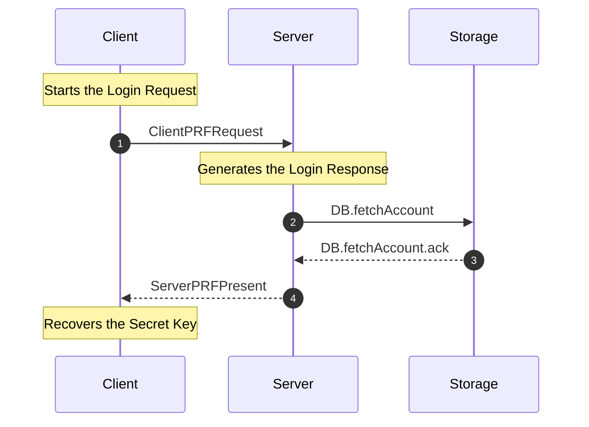

1. **Client Starts the Login Request**:
    * Client sends $M = r \cdot H_p(pass)$.
    * Server executes `DB.fetchAccount` to read the account bound to user $uuid$.
2. **Server Generates the Login Response**:
    * If the fetch result is “matched”, server directly uses the returned $\epsilon$, then combines it with the real
      parameter $v$ to compute the response and returns `ServerPRFPresent` $(N, \epsilon)$.
    * If the fetch result is “not found”, server
      uses $(salt^{\ast}, \phi_{pass}^{\ast}, \psi_{pass}^{\ast}, \phi_{mnem}^{\ast}, \psi_{mnem}^{\ast})$ in place of
      the real parameters and uses $v^{\ast}$ in place of $v$ to compute the fake
      response $(N^{\ast}, \epsilon^{\ast})$.
    * Server returns either `ServerPRFPresent` $(N, \epsilon)$ or $(N^{\ast}, \epsilon^{\ast})$ to prevent client-side
      user enumeration.
3. **Client Recovers the Secret Key**:
    * Client recovers $v \cdot P_{pass}$ and re-derives $(\phi_{pass}, \psi_{pass})$ via $pass$.
    * Client extracts $\psi_{pass} \oplus s$ from $\epsilon$ and
      verifies $\mathrm{HMAC}(\phi_{pass}, (salt, \psi_{pass} \oplus s, \tilde{V}, PK)) \stackrel{?}{=} \alpha_{pass}$.
    * Upon success, client recovers secret key $s$.

### C. Mnemonic Recovery

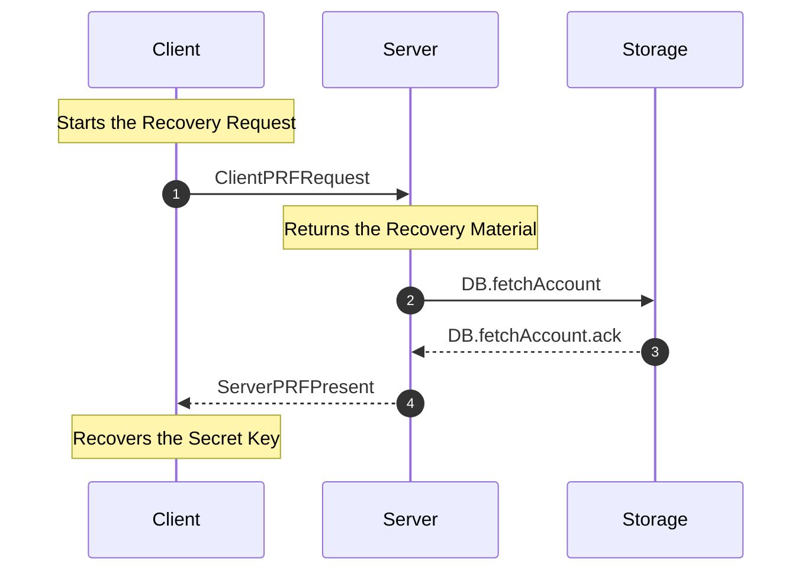

1. **Client Starts the Recovery Request**:
    * Client sends $M = r \cdot H_p(pass)$.
    * Server executes `DB.fetchAccount` to read the account bound to user $uuid$.
2. **Server Returns the Recovery Material**:
    * Server returns the corresponding recovery material according to the account fetch result and then returns
      `ServerPRFPresent`, consistent with the user password login flow.
3. **Client Recovers the Secret Key**:
    * User inputs mnemonic $mnem$.
    * Client re-derives $(\phi_{mnem}, \psi_{mnem})$ from $mnem$.
    * Client extracts $\psi_{mnem} \oplus s$ from $\epsilon$ and
      verifies $\mathrm{HMAC}(\phi_{mnem}, (salt, \psi_{mnem} \oplus s, \tilde{V}, PK)) \stackrel{?}{=} \alpha_{mnem}$.
    * Upon success, client recovers secret key $s$.

### D. User Signature Authorization

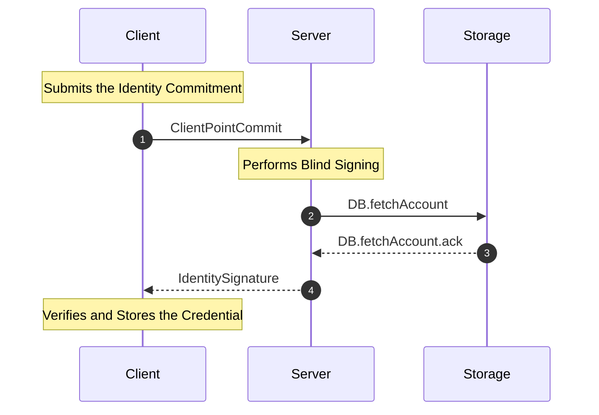

1. **Client Submits the Identity Commitment**:
    * Client reads local secret key $s$ and computes point commitment $S = s \cdot G$.
    * Client sends `ClientPointCommit` $S$ to the server.
2. **Server Confirms Identity Attributes and Performs Blind Signing**:
    * Server first executes `DB.fetchAccount` to read user identity attributes together with the stored commitment $S$.
    * During signature authorization, the identity-attribute fetch result must be “matched”; otherwise issuance fails.
    * Server compares the client-submitted $S$ with the stored $S$, and assigns $role$ only if they match.
    * Server computes the role scalar $h_{role} = H_s(role)$.
    * Server samples random scalar $r \in \mathbb{Z}_p$.
    * Server computes signature base $A = r \cdot G$.
    * Server computes blinded signature $B = (h_{role} \cdot w + x) \cdot A + y \cdot (r \cdot S)$.
    * Server returns `IdentitySignature` $\sigma = (role, A, B)$.
3. **Client Verifies and Stores the Credential**:
    * Client computes role hash $h_{role} = H_s(role)$.
    * Client verifies
      $e(B, \tilde{G}_{neg}) \cdot e(A, h_{role} \cdot \tilde{W} + \tilde{X} + s \cdot \tilde{Y}) \stackrel{?}{=} 1_T$.
    * If verification passes, the credential is valid and stored.

### E. User Vote Submission

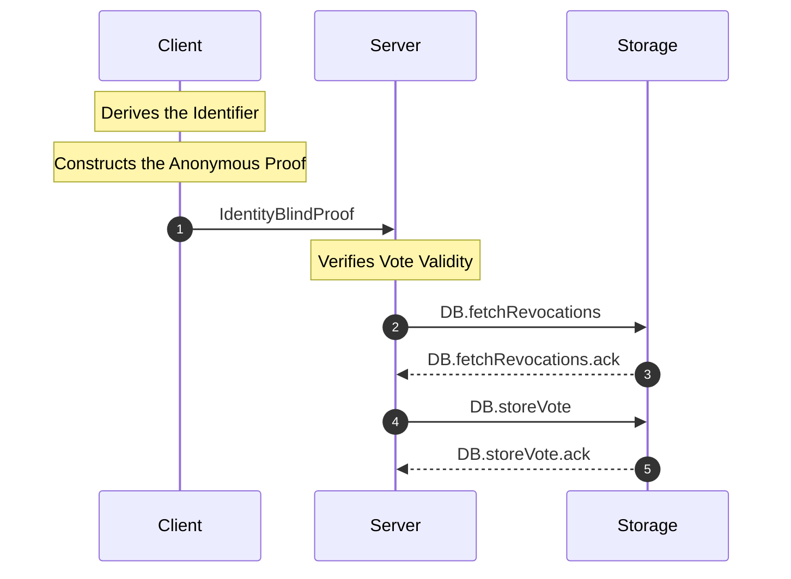

1. **Client Derives the Identifier**:
    * Compute the hash point of voting target $work$ as $P_{work} = H_p(work)$.
    * Compute the derived identifier `IdentityDerivation` $ID = s \cdot P_{work}$.
2. **Client Constructs the Anonymous Proof**:
    * Select random numbers $q, r \in \mathbb{Z}_p$.
    * Re-randomize the signature: $A' = q \cdot A, B' = q \cdot B$.
    * Generate commitments: $Q = r \cdot P_{work}$ and $R = e(A', r \cdot \tilde{Y})$.
    * Generate challenge: $c = H_s(PK, H_s(work, ID, info, role, A', B'), Q, R)$.
    * Generate response: $z = r + c \cdot s \pmod p$.
    * Construct the proof $\pi = (work, ID, info, role, A', B', c, z)$.
    * Submit `IdentityBlindProof` $\pi$, including public information $info$ and the proof of identity validity.
3. **Server Verifies Vote Validity**:
    * Server first executes `DB.fetchRevocations` to read every $\tilde{C}_i$ in the revocation list.
    * For every $\tilde{C}_i$ in the revocation list, server must perform the revocation check
      $e(ID, \tilde{G}) \stackrel{?}{=} e(P_{work}, \tilde{C}_i)$.
    * If any revocation check succeeds, or if the server does not complete the full per-item scan of the revocation
      list, the vote is rejected.
    * Reconstruct intermediate values $d' = H_s(work, ID, info, role, A', B')$ and $h_{role} = H_s(role)$.
    * Reconstruct commitments
      $Q' = z \cdot P_{work} - c \cdot ID$ and
      $R' = e(A', c \cdot h_{role} \cdot \tilde{W} + c \cdot \tilde{X} + z \cdot \tilde{Y}) \cdot e(c \cdot B', \tilde{G}_{neg})$.
    * Check whether $H_s(PK, d', Q', R') \stackrel{?}{=} c$.
    * If verification succeeds, server executes `DB.storeVote` to store the corresponding $ID$ and $info$.

### F. User Vote Revocation

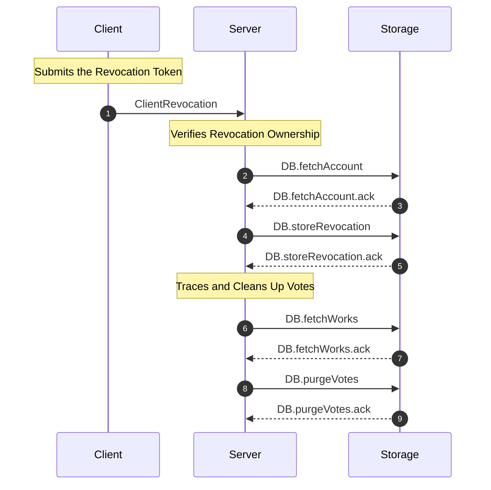

1. **Client Submits the Revocation Token**:
    * User sends `ClientRevocation` $\tilde{C} = s \cdot \tilde{G}$ through an authenticated channel.
2. **Server Verifies Revocation Ownership**:
    * Server first executes `DB.fetchAccount` to read user identity attributes together with the commitment $S$
      associated with the current account.
    * During revocation authorization, the identity-attribute fetch result must be “matched”; otherwise revocation
      fails.
    * Server uses the fetched $S$ to verify $e(S, \tilde{G}_{neg}) \cdot e(G, \tilde{C}) = 1_T$.
3. **Server Traces and Cleans Up Votes**:
    * Server executes `DB.storeRevocation` to place $\tilde{C}$ into the revocation list.
    * Server executes `DB.fetchWorks` to read all voting-target metadata, and computes the corresponding
      $P_{work} = H_p(work)$ for each target.
    * For each voting target, server executes `DB.purgeVotes` to clear all vote records satisfying
      $e(ID, \tilde{G}) \stackrel{?}{=} e(P_{work}, \tilde{C})$.

## 3. Detailed Equality Proofs

* **VOPRF Verification Proof**  
  $e(N, \tilde{G}_{neg}) \cdot e(M, \tilde{V}) = e(v \cdot M, \tilde{G})^{-1} \cdot e(M, v \cdot \tilde{G}) = e(M, \tilde{G})^{-v} \cdot e(M, \tilde{G})^v = 1_T$
* **Blind Signature Verification Proof**  
  $e(B, \tilde{G}_{neg}) \cdot e(A, h_{role} \cdot \tilde{W} + \tilde{X} + s \cdot \tilde{Y}) = e((h_{role} \cdot w + x + s \cdot y) \cdot A, \tilde{G}_{neg}) \cdot e(A, (h_{role} \cdot w + x + s \cdot y) \cdot \tilde{G}) = 1_T$
* **Anonymous Proof $Q'$ Reconstruction**  
  $Q' = z \cdot P_{work} - c \cdot ID = (r + c \cdot s) \cdot P_{work} - c \cdot (s \cdot P_{work}) = r \cdot P_{work} + (c \cdot s - c \cdot s) \cdot P_{work} = Q$
* **Anonymous Proof $R'$ Reconstruction**  
  $\begin{aligned} R' &= e(A', c \cdot h_{role} \cdot \tilde{W} + c \cdot \tilde{X} + z \cdot \tilde{Y}) \cdot e(c \cdot B', \tilde{G}_{neg}) \\ &= e(A', c \cdot h_{role} \cdot \tilde{W} + c \cdot \tilde{X} + (r + c \cdot s) \cdot \tilde{Y}) \cdot e(c \cdot B', \tilde{G}_{neg}) \\ &= e(A', r \cdot \tilde{Y}) \cdot e(A', c \cdot (h_{role} \cdot \tilde{W} + s \cdot \tilde{Y} + \tilde{X})) \cdot e(c \cdot B', \tilde{G}_{neg}) \\ &= R \cdot e(c \cdot A', (h_{role} \cdot w + x + s \cdot y) \cdot \tilde{G}) \cdot e(c \cdot B', \tilde{G}_{neg}) \\ &= R \cdot e(c \cdot (h_{role} \cdot w + x + s \cdot y) \cdot A', \tilde{G}) \cdot e(c \cdot B', \tilde{G}_{neg}) \\ &= R \cdot e(c \cdot B', \tilde{G}) \cdot e(c \cdot B', \tilde{G}_{neg}) \\ &= R \end{aligned}$
* **Revocation Attribution Proof**  
  $e(S, \tilde{G}_{neg}) \cdot e(G, \tilde{C}) = e(s \cdot G, \tilde{G}_{neg}) \cdot e(G, s \cdot \tilde{G}) = e(G, \tilde{G})^{-s} \cdot e(G, \tilde{G})^s = 1_T$
* **Revocation Identifier Retrieval Proof**  
  $e(ID, \tilde{G}) = e(s \cdot P_{work}, \tilde{G}) = e(P_{work}, s \cdot \tilde{G}) = e(P_{work}, \tilde{C})$

## 4. Entity Mapping Table

| Class Name           | Corresponding Variable                       | Bytes (BLS12-381)                               |
|:---------------------|:---------------------------------------------|:------------------------------------------------|
| `ClientPointCommit`  | $S = s \cdot G$                              | $48$                                            |
| `ClientPRFOverride`  | $(S, \epsilon)$                              | $272$                                           |
| `ClientPRFRequest`   | $M = r \cdot P_{pass}$                       | $48$                                            |
| `ClientRevocation`   | $\tilde{C} = s \cdot \tilde{G}$              | $96$                                            |
| `ClientSecretKey`    | $s$                                          | $32$                                            |
| `IdentityDerivation` | $ID = s \cdot P_{work}$                      | $48$                                            |
| `IdentityBlindProof` | $\pi = (work, ID, info, role, A', B', c, z)$ | $224 + \mathrm{len}(role) + \mathrm{len}(info)$ |
| `IdentityUserEntry`  | $(uuid, S, \epsilon, role)$                  | $288 + \mathrm{len}(role)$                      |
| `IdentitySignature`  | $\sigma = (role, A, B)$                      | $96 + \mathrm{len}(role)$                       |
| `ServerPRFAbsent`    | $N = v \cdot M$                              | $48$                                            |
| `ServerPRFPresent`   | $(N, \epsilon)$                              | $272$                                           |
| `ServerPublicKey`    | $(\tilde{V}, PK)$                            | $384$                                           |
| `ServerSecretKey`    | $(v, SK)$                                    | $128$                                           |
